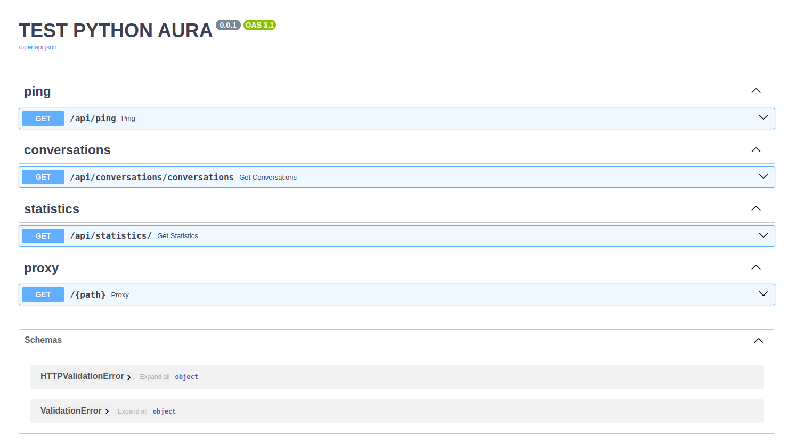
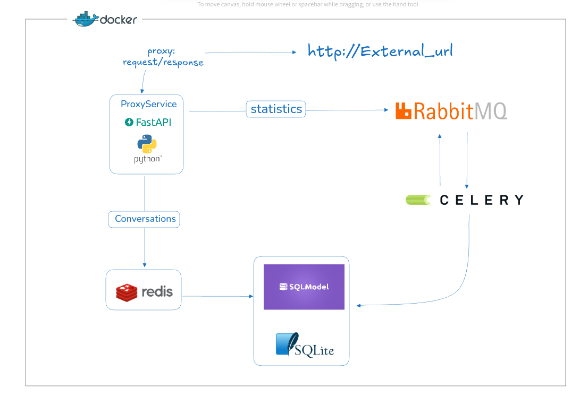
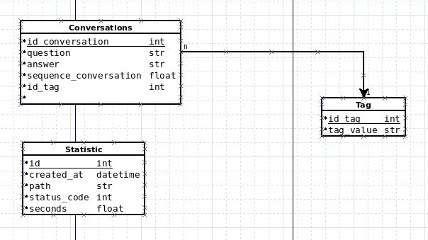

# Test Python Aura - Gerardo Benitez
this is a challenge project proposed by daCodes 

see more in [PDF Instructions](./static/test_python_aura.pdf) 

## This project involve

* FastAPI
* Docker
* SQLModel (SqlAchemy)
* RabbitMQ
* Celery
* PostgreSql / SQLite

## Requirements

Python 3.9+

## Project

### Setup environment
1. copy .env.example to .env
2. set environment variables

### Run It: option 1 with docker

1. Start the project 

```sh
docker-compose up
```

### Run It: option 2 manually
1. Start Postgres DB
   ```sh
   docker-compose up postgres
   ```
2. Start api
   ```sh
   python3 -m venv .venv
   source .venv/bin/activate
   pip install requirements.txt
   set -a
   source .env
   set +a
   uvicorn app.main:app --host 0.0.0.0 --port 9009 --reload
   
   ```
3. Start RabbitMq
    ```sh
   docker-compose up rabbit
   ```
4. Start Celery

    in other console
   ```sh
   
   source .venv/bin/activate
   set -a
   source .env
   set +a
   celery -A app.core.celery_worker worker --loglevel=info -Q report_tabs
   
   ```

### Logs
The applications logs are located in 
```
./logs/app.logs
```

### Working

#### Proxy Service
* Implementar un servicio que actúe como proxy para un API ficticio
`http://cualquierapi.com`
* El servicio debe poder manejar peticiones como: curl
 `http://127.0.0.1:8080/categories/MLA97994` y redirigirlas a
`http://cualquierapi.com/categories/MLA97994`
Utilizar FastAPI como framework web para el servicio.
```
curl --request POST 'http://127.0.0.1:9009/categories/MLA97994' 
```

*Decisiones:*
- usar la url de MercadoLibre, el servicio cualqiuierapi.com no existe por tanto simpre mis request caian en `RequestError`
- Escribir los logs usando `background_task`, ya que se trata de una tarea de menor importancia, se puede hacer asincronica y en segundo plano
- Guardar Estadisticas usando `Celery Task` y `RabbitMQ`, también se trata de una tarea secundaria, decidí hacerlo con Celery y RabbitMQ para mostrar un poco más de versatilidad
- Manejo de errors y excepciones, extendí el manejador de errores de FastApi para tener mejor legibilidad del codigo

#### Conversations API
```
curl --request GET 'http://127.0.0.1:9009/api/conversations?company=microsoft&tags=competition,orientation' 
```
*Decisiones:*
- Tomar el set de datos de ejemplo que venia en formato Parquet, descargarlo, leerlo y minar una base de datos SQLite para trabajar con ella
- Usar SQLModel para consultas y modelos y schemas
- Utilizar Redis cache para evitar conectar a la db para peticiones repetidas y ganar en escalabilidad
- No habia una relacion entre Conversaciones y Companias por lo tanto no hubo cruce de datos

#### Estadisticas
Cree un endpoint básico para consultar una estadistica general de uso del proxy, este endpoint no tiene filtros, muestra todas las estadicas
con el formato 
```
[
  {
    "status_code": 404,
    "id": 1,
    "path": "https://www.mercadolibre.com.ar/Hola",
    "seconds": 0.309469,
    "created_at": "2024-09-30T23:04:16.466846"
  },
 ]
```

Ejemplo de LLamada
```
curl -X 'GET' \
  'http://127.0.0.1:9009/api/statistics/' \
  -H 'accept: application/json' 
```

#### Unit Test
Solo cree test unitarios para algunos endpoints, me escaseaba el tiempo y 
prefería tener una implementación más completa, quizá con menos cobertura de test
pero a la vez también pudiendo demostrar que se escribir test unitarios

### Api Documentation
Utilicé el sistema de documentacion propuesto por FastApi que integra Swagger para probar la api y documentarla 
Go to [http://localhost:9009/docs](http://localhost:9009/docs).



## Architecture



## Database


